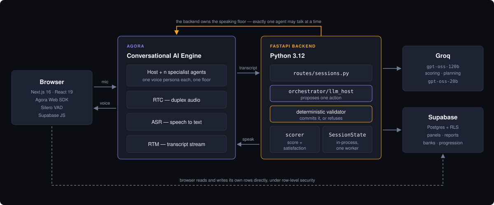
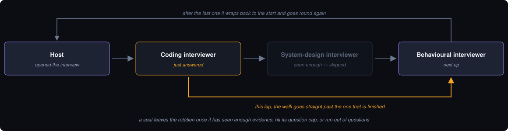
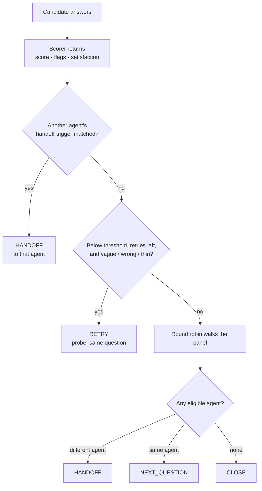
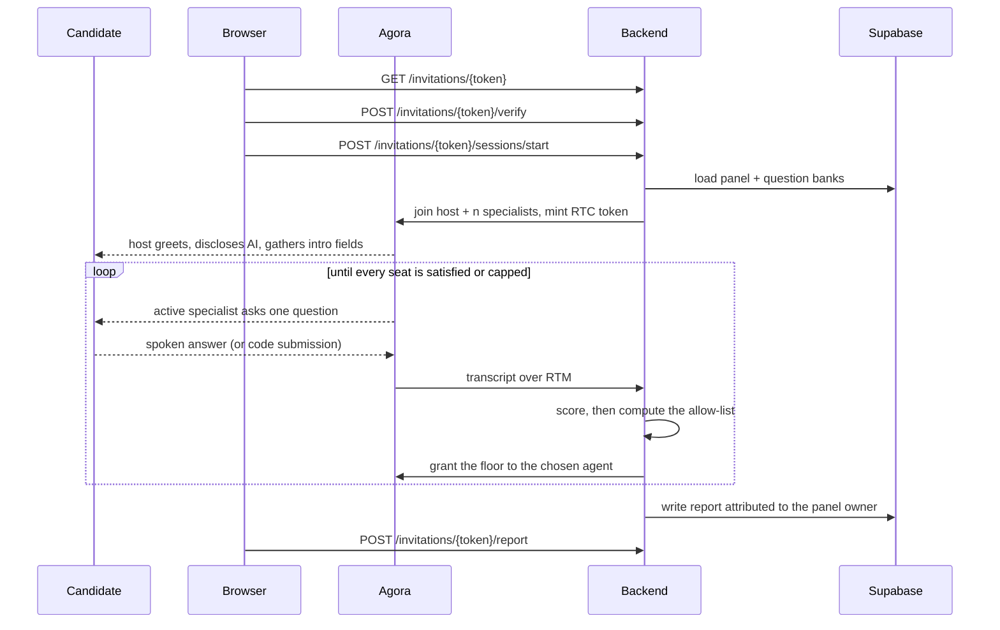
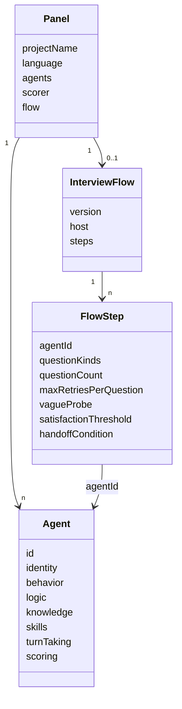

# Adaptive Interview Platform

A live panel of AI interviewers. A candidate joins a voice call with a host and
*n* specialists, answers spoken questions and coding tasks, and comes out with a
scored, evidence-linked report.

Two products, one interview engine:

| | |
|---|---|
| **Individual** | Gamified practice. DSA skill path, timed coding, verbal follow-ups, XP · gems · trophies · leagues. |
| **RecruitPro** | Enterprise suite. Build a panel, invite candidates, run interviews at any volume, query the reports by voice. |

Built on Agora's **Conversational AI Engine** — not RTC with a chatbot bolted on.



---

## The problem this solves

Put several AI agents in one voice channel and they answer each other. The
candidate becomes a spectator. Every design decision below exists to prevent
that.

**The model never mutates runtime state.** `legal_host_actions` computes an
allow-list; `plan_host_action` asks Groq to pick from it; the session route
commits it. Malformed or adversarial output cannot activate two speakers, exceed
a retry cap, ask a forbidden question kind, or address someone who isn't in the
room.

**One floor, always.** Every agent joins for the whole session and owns its own
context and transcript. Candidate speech is routed only to the active
specialist, so agents never hear each other.

### Whose turn it is

`_round_robin_target` walks the flow steps from the current index, wrapping once
around the panel, and returns the first step whose agent is still eligible.



An agent stays eligible while **all three** hold:

| Condition | Field |
|---|---|
| Still needs evidence | `assessment_satisfaction < step.satisfactionThreshold` |
| Under its question cap | `len(asked_item_ids) < step.questionCount` |
| Has questions left | `not bank_exhausted` |

A full lap with nothing eligible returns `None` and the host closes. Eligibility
is **assessment-oriented, not score-oriented**: an agent stays in rotation while
it lacks evidence even when answers are poor, and a detailed *weak* answer can
retire it early.

### What the host may do after an answer

Checked strictly in order. Usually only one action survives, in which case the
model is never called.



A probe reuses the same bank question, so evidence accumulates across the
original answer and its follow-ups. The candidate is never asked to repeat
themselves to earn credit.

---

## Stack

| Layer | What |
|---|---|
| Backend | FastAPI, Python 3.12, Pydantic v2 |
| Frontend | Next.js 16, React 19, Tailwind 4, Zustand |
| Voice | Agora Conversational AI + RTC + RTM, Silero VAD in-browser |
| Models | Groq `openai/gpt-oss-120b` (scoring, planning) · `openai/gpt-oss-20b` (voice personas) |
| Data | Supabase Postgres, row-level security throughout |
| Deploy | Docker Compose, two services |

The model split is a latency choice: the 120b writes evidence-specific
transition instructions, the 20b speaks them in role, where a spoken turn has to
land fast.

---

## Quickstart

```bash
cp .env.example .env      # fill it in
docker compose up --build
```

Frontend `:3000` · backend `:8000` · generated API docs `:8000/docs`.

Without Docker:

```bash
cd backend && pip install -r requirements.txt && uvicorn app.main:app --reload --port 8000
cd frontend && npm install && npm run dev
```

`predev` copies the VAD assets — running `next dev` directly without it leaves
speech detection broken.

### Configuration

[`.env.example`](./.env.example) is annotated and authoritative. Two traps:

- **`NEXT_PUBLIC_*` is baked into the bundle at build time.** They are
  `build.args` in `docker-compose.yml`, not `environment`. Changing one needs
  `docker compose build frontend`, not a restart. Put them under `environment`
  and the app reports "Supabase is not configured" while `docker compose exec
  frontend env` cheerfully shows them set.
- **Never put the Supabase secret key in a `NEXT_PUBLIC_` variable.** It
  bypasses RLS and would ship in the browser bundle.

`AGENT_IDLE_TIMEOUT_SECONDS` defaults to 1800, not the SDK's 180: every
specialist joins at session start and waits its turn, and the SDK default reaped
interviewers mid-panel.

### Supabase

Not a container. It is hosted, the browser talks to it directly under RLS, and
the backend uses a server-only secret key for protected content. Run in the SQL
Editor, in order:

```
schema.sql → schema_reports.sql → schema_invitations.sql
→ schema_user_question_banks.sql → schema_gamification.sql
→ schema_dsa_question_bank.sql
```

`schema_gamification_test.sql` is a seventh file for exercising the award
functions — not part of setup.

`schema_reports.sql` doubles as the upgrade migration for the older minimal
`interview_reports` table. Re-run the whole file after pulling; do not drop the
table first. See [`supabase/README.md`](./supabase/README.md) for why there are
two report writers.

Publish the DSA catalog with `python backend/scripts/import_dsa_question_bank.py`.

---

## How an interview runs



Coding `Run` executes public examples only. `Submit` evaluates the full
public-plus-hidden suite, redacts hidden inputs and outputs, and sets the
question score to `passed / total`.

---

## Repo layout

```
backend/
  app/
    main.py               /health, /token, /agents/start, CORS
    routes/               sessions (the runtime), dsa_sessions, invitations,
                          job_panels, report_queries, knowledge, config
    orchestrator/         llm_host, conversation, scorer, state, report, agent_launcher
    dsa/                  question_bank, code_runner, runner_worker, evaluator, followups
    knowledge/            upload parsing + retrieval
    schemas/              panel, job_panel, report
  tests/                  9 modules, ~1.8k lines
  recipes/ data/ knowledge-bases/    read at runtime, copied into the image
  agora-token-tools/      vendored Agora token builders — one subdirectory is required

frontend/
  app/                    /skills, /enterprise, /interview-room, /builder,
                          /practice, /reports, /leaderboard, /profile
  components/console/     RecruitPro console
  hooks/useAgoraVoiceClient.ts   the voice client — read before touching audio
  lib/ store/             Supabase client, panels, reports, gamification, Zustand

supabase/                 7 schema files
architectural-decisions/  ADR-001..012, maintained under a revision rule
test-knowledge-base/      scorer evaluation harness
docs/                     diagrams
```

`agora-token-tools/` looks like dead weight and is not.
`token_generator.py` appends
`DynamicKey/AgoraDynamicKey/python/src` to `sys.path` and imports
`RtcTokenBuilder2` from there — it is not a PyPI package, and `backend/Dockerfile`
copies exactly that path. Drop it and the container starts fine, then 500s on the
first token request.

---

## HTTP API

Generated docs at `/docs`. Grouped by router.

**Root** — `GET /health` (deliberately does no work; a health check that calls
Agora or Groq reports *their* outage as this service being down), `GET /token`,
`POST /agents/start`. The last two require a caller credential: an RTC token is
issued for a named channel, so an unauthenticated mint would let anyone sit
silently in a live interview.

**Enterprise runtime** — `routes/sessions.py`, no prefix

```
POST /sessions/start
POST /sessions/{id}/next
POST /sessions/{id}/candidate-ready
POST /sessions/{id}/break
POST /sessions/{id}/silence-prompt
POST /sessions/{id}/run-code
POST /sessions/{id}/submit-code
POST /sessions/{id}/end
GET  /sessions/{id}/report
```

**Individual DSA** — `/dsa/sessions`

```
GET  /dsa/sessions/catalog
POST /dsa/sessions/start
POST /dsa/sessions/{id}/begin-coding
POST /dsa/sessions/{id}/run
POST /dsa/sessions/{id}/submit
POST /dsa/sessions/{id}/break
POST /dsa/sessions/{id}/silence-prompt
POST /dsa/sessions/{id}/finish
POST /dsa/sessions/{id}/end
GET  /dsa/sessions/{id}/report
```

**Invitations** — `/invitations`. No shared interview link exists; each row holds
the email it was issued to and a 256-bit token.

```
GET  /invitations/{token}
POST /invitations/{token}/verify
POST /invitations/{token}/sessions/start
POST /invitations/{token}/report
```

**Report querying** — `/report-query`. The recruiter asks out loud and gets
answers from stored reports.

```
POST /report-query/sessions/start
POST /report-query/interpret
POST /report-query/sessions/{id}/interpret
POST /report-query/sessions/{id}/respond
POST /report-query/sessions/{id}/end
```

**Others** — `GET /job-panels`, `GET /job-panels/{slug}`,
`POST /knowledge/parse` (multipart), `POST /knowledge/parse-text`,
`GET /config/languages`.

---

## Data model

### Panel — how an interview is configured



`Panel.resolved_flow()` synthesises a flow from the agent list in memory, so a
panel saved before flows existed still runs without a Supabase migration.
`Agent.voice` still exists but is legacy and ignored at runtime.

### Session state — what a running interview holds

Lives in memory. See Known limits.

```
SessionState
  session_id, panel_project_name, language
  candidate_name, candidate_ref, started_at, finished_at
  current_agent_id, current_visit_turn_count, flow_step_index
  queue[], agent_states{}, transcript[], is_finished
  floor: "agent_speaking" | "candidate_speaking" | ...
  question_revision      leases Agora speaking-completion events

AgentSessionState
  visit_count, force_closed
  competency_scores{name: CompetencyScore{score, covered, assessed}}
  asked_item_ids[], pending_item_id, bank_exhausted
  retries_by_item{}, assessment_satisfaction

TranscriptTurn
  turn_number, agent_id, speaker, text, flags[],
  knowledge_item_id, coverage, question_score, assessment_satisfaction
```

### Scoring output

```
ScoreResult
  competency_scores{name: 0-1}    current agent only
  flags[]                          "vague", "contradiction"
  triggered_agent_ids[]            whose handoffTriggers matched this turn
  coverage: float | None           0-1 against the reference answer
  missing_points[]                 what the reference had and the answer didn't
  answer_correct: bool             this question is resolved and may advance
  assessment_satisfaction: float   evidence sufficiency — NOT answer quality
```

The last two drive everything: `answer_correct` gates the question,
`assessment_satisfaction` gates the agent's place in the rotation.

### Report

`CompetencyResult` (score, threshold, weight, covered, `checked_by`,
`used_default_rule`), `AgentReport` (visits, questions_answered, satisfaction,
score, weight, `force_closed`, knowledge questions asked/total),
`TranscriptEntry`, and `ReportTotals` with a weighted `overall_score`.

### Supabase tables

| Area | Tables |
|---|---|
| Panels | `panels` |
| Reports | `interview_reports`, `interview_report_scores`, `interview_starts` |
| Invitations | `interview_invitations` |
| Question banks | `question_banks`, `question_topics`, `user_question_banks`, `user_question_bank_items`, `assessment_blueprints`, `assessment_blueprint_topics` |
| DSA | `dsa_questions`, `dsa_question_versions`, `dsa_question_topics`, `dsa_test_cases`, `dsa_attempts`, `dsa_followups` |
| Progression | `player_profiles`, `xp_events`, `gem_events`, `trophies`, `user_trophies`, `league_seasons`, `league_tiers`, `league_cohorts`, `league_members` |

---

## Knowledge bases

`POST /knowledge/parse` dispatches on extension:

| Extension | Parsed as |
|---|---|
| `.csv` | delimiter sniffed from `, ; \t \|` |
| `.tsv` | tab |
| `.json` | array or object form |
| `.jsonl`, `.ndjson` | one item per line |
| `.md`, `.markdown`, `.txt`, none | `Q: ... A: ...` blocks, or one question per line |

UTF-8 with a BOM allowance, falling back to latin-1. Items are deduplicated on
the whitespace-normalised lowercased question and capped at 500 per upload. A
CSV needs a `question` column; `answer` is optional. Samples in
`backend/knowledge-bases/`.

---

## Progression, and why the leaderboard is trustworthy

**A player must never be able to choose their own score.** `xp_events` and
`gem_events` carry *only* a `select` policy — `xp_events_read_own` and
`gem_events_read_own`. The browser has no `insert` or `update` policy on either
table at all.

Every award goes through a `security definer` function that derives the amount
itself. `award_interview_xp(p_report_id uuid)` takes a **report id**, not an
amount: it refuses a report belonging to another user, refuses an incomplete
one, and is idempotent through a unique index on `(user_id, source, ref_id)`, so
a client retrying on a flaky connection cannot double-pay.

That invariant is what makes contest and leaderboard prizes safe to attach to
real money.

---

## Measuring the panel

Two different questions, needing different metrics. The second is the half most
interview products skip.

**What the panel says about a candidate** — per-competency score and `covered`
flag, `assessment_satisfaction`, `coverage` against the reference answer,
`missing_points`, `vague` / `contradiction` flags, visit count and
`force_closed`, and a weighted `overall_score`.

**Whether the panel is any good at its job** — `test-knowledge-base/` runs the
real parser, retrieval, prompt assembly and `orchestrator.scorer` against
candidate answers of known quality, then compares against an independent LLM
judge:

```bash
cd test-knowledge-base
python run_eval.py --offline     # deterministic stub, plumbing only
export GROQ_API_KEY=...
python run_eval.py
python run_eval.py --repeat 5    # score each answer 5x, report variance
```

A score you cannot defend is worse than no score.

---

## Tests

Nine modules. There is no pytest config and pytest is not a dev dependency —
each module asserts at import and prints its own summary, so `python -m` is the
runner:

```bash
cd backend && pip install -r requirements-dev.txt   # adds httpx for TestClient
python -m tests.test_e2e
python -m tests.test_orchestrator
python -m tests.test_llm_host_flow
python -m tests.test_knowledge_and_voice
python -m tests.test_dsa_session_flow
python -m tests.test_dsa_question_bank
python -m tests.test_job_panels
python -m tests.test_report_queries
python -m tests.test_agent_weighted_report
```

`test_e2e.py` runs its whole scenario at import, then exposes a single named
`test_end_to_end_scenario_completed` asserting a module-level flag — so a
truncated run fails loudly instead of silently reporting a pass. That is how a
stale assertion once hid roughly fifty checks that had stopped running.

`tests/` is excluded from the image by `.dockerignore`, so in Docker:

```bash
docker compose run --rm --entrypoint sh backend \
  -c "pip install -r requirements-dev.txt && python -m tests.test_e2e"
```

---

## Container notes

Backend is `python:3.12-slim`, non-root (uid 10001), requirements copied before
app code so editing code doesn't rebuild the dependency layer. The `HEALTHCHECK`
uses `python -c urllib.request` rather than curl, because the slim image has
neither curl nor wget.

Frontend is multi-stage `node:22-alpine`, non-root, using Next's
`output: "standalone"` so the runtime image carries only the `node_modules` it
actually reaches. `next.config.ts` disables standalone when `VERCEL` is set,
since Vercel runs its own output tracing.

Two entries in `requirements.txt` are there despite never being imported by
name, which is exactly how they get dropped: `uvicorn[standard]` (the server) and
`python-multipart` (FastAPI needs it for `UploadFile` in `routes/knowledge.py`,
and without it `POST /knowledge/parse` fails at import).

---

## Architectural decisions

`architectural-decisions/` holds ADR-001 through ADR-012 under a maintenance
rule: a change that affects a decision updates that document in the same commit
and adds a dated revision entry. Superseded decisions get marked and linked, not
rewritten.

Start with **006** (enterprise information architecture), **008** (agent-owned
scoring), **011** (host plus concurrent specialists), **012** (adaptive
conversation).

---

## Known limits

Confirmed in the code.

- **`SESSIONS` is an in-process dict** (`routes/sessions.py:53`). Sessions do not
  survive a restart, and a session started on one worker is invisible to another.
  `--workers 2` breaks interviews. Redis before any horizontal scaling.
- **The DSA code runner is not a security boundary.** Its own docstring says so.
  It validates a small Python subset by AST — no imports, no classes, no `eval`,
  `exec`, `open` or `__import__` — then runs an isolated interpreter with a
  minimal builtin set and a 3-second wall clock. Production needs an ephemeral
  container with CPU, memory, filesystem and network limits
  ([ADR-003](./architectural-decisions/003-dsa-timed-coding-interview-flow.md)).
- **No reverse proxy or TLS in the compose stack.** Agora's WebRTC needs HTTPS
  from anything that isn't localhost.
- **Best score, not last.** `CompetencyScore.score` holds the best score seen
  across the session, so a candidate who flounders and recovers is credited with
  the recovery. Right for practice; for hiring you probably want the last or a
  recency-weighted score.
- **`backend/agent-samples/` is vendored and unused.** 40 MB and 188 files of
  Agora's sample repo, referenced by nothing — no import, no Dockerfile, no
  compose entry. Safe to delete.
- **No root licence.** The vendored Agora directories carry their own `LICENSE`
  files; the project itself does not declare one yet.

## Disclosure

The spoken host opening discloses that the participant is interviewing with AI.
The candidate form carries the same disclosure in writing, independently. Both
are deliberate — do not remove one because the other exists.
